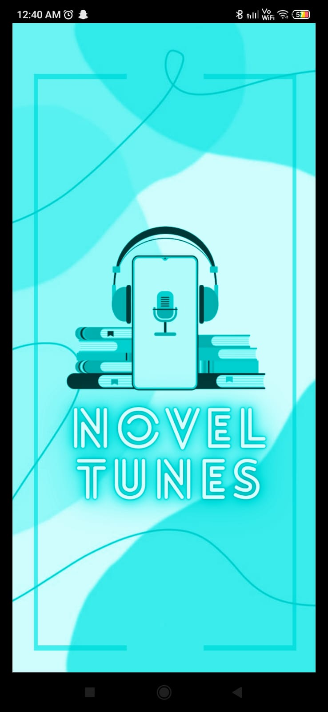
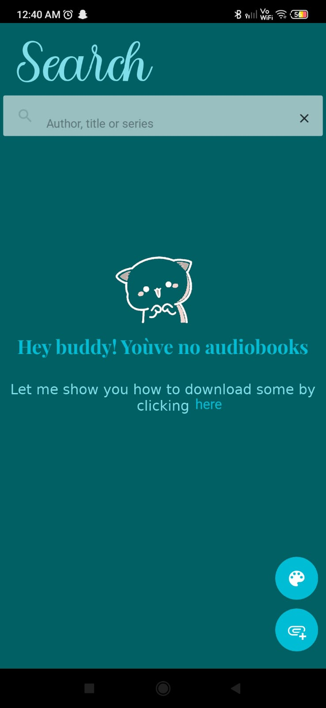
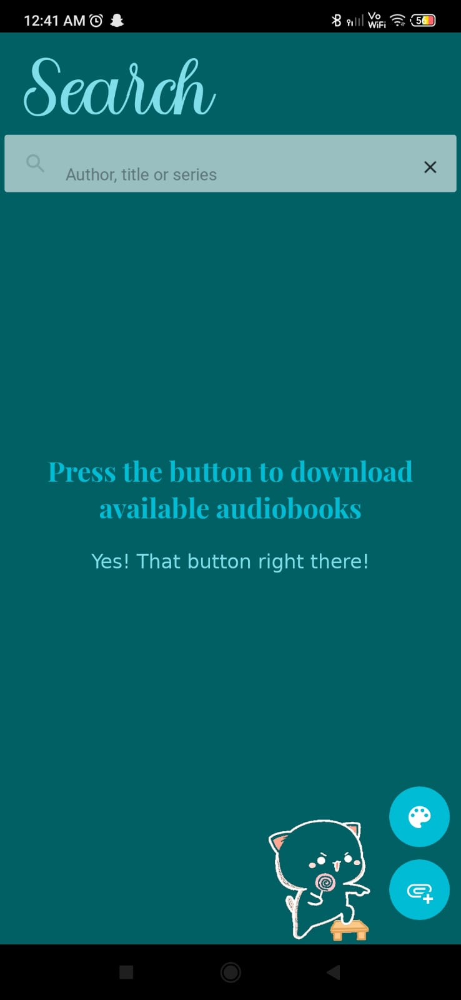
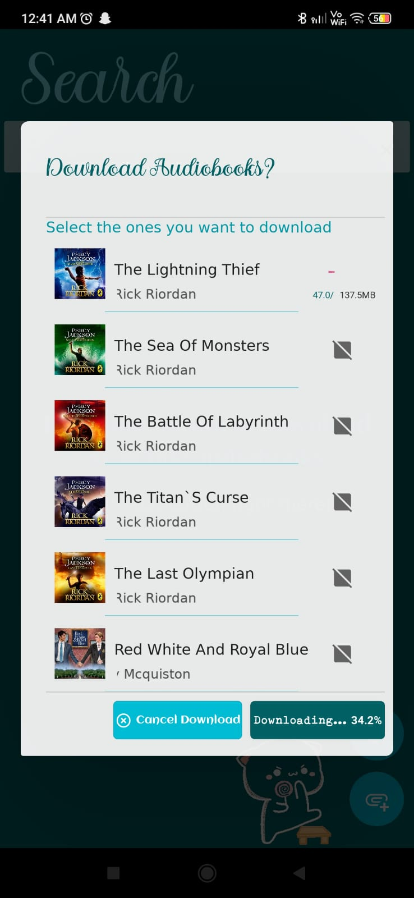
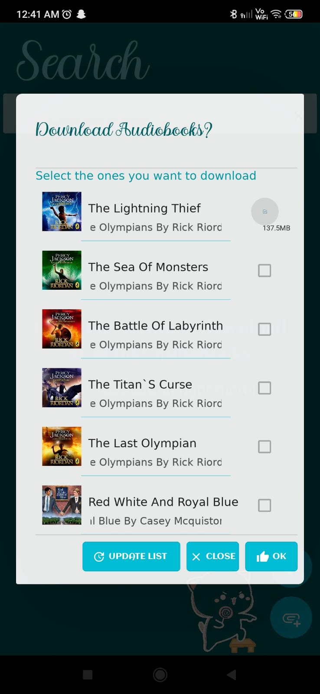
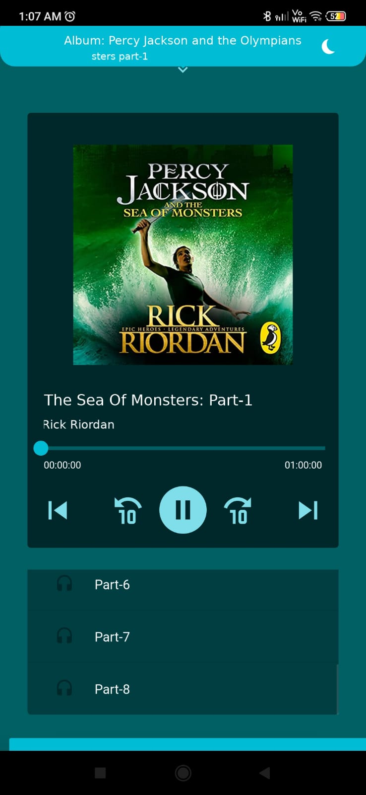
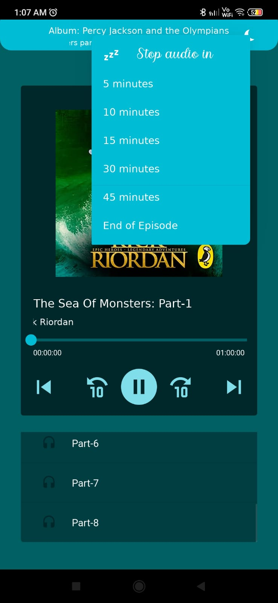
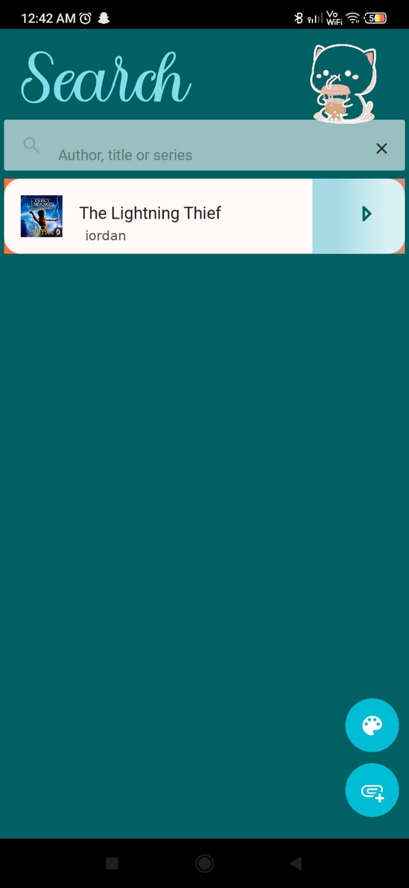
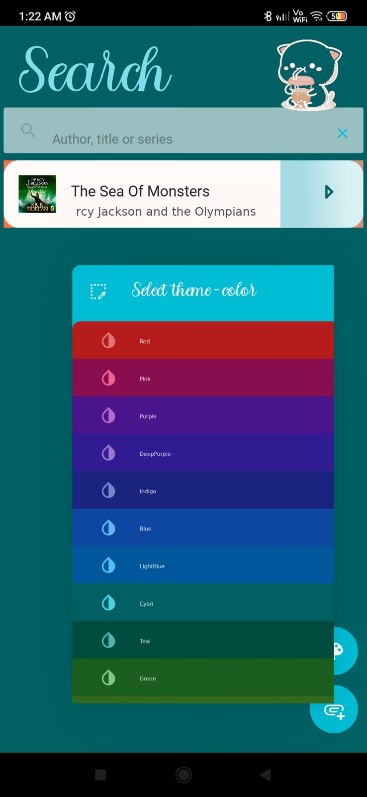
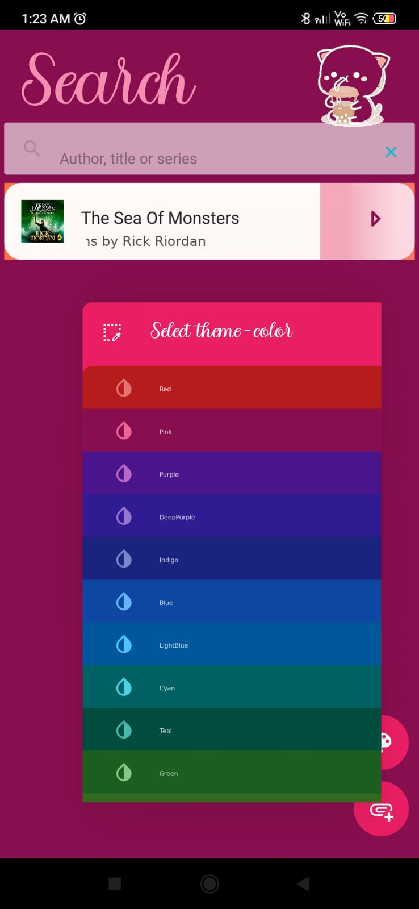

# KivyMD Audiobook Player 🎧

A minimalist, offline-friendly **audiobook player app** built using **KivyMD**, with support for audio part selection, playback control, and sleep timer functionality. Designed with a smooth UI and persistent local storage for downloaded content.

---

## Features

- **Multi-Part Audiobook Support**  
  Each book consists of multiple audio parts, selectable from a dropdown.

- **Playback Controls**  
  Play, pause, and seek support with real-time UI updates.

- **Sleep Timer**  
  Set auto-pause after 5, 10, 15, 30 minutes, or at the end of the episode.

- **Persistent & Syncing Storage**
  Automatically saves downloaded audiobooks and their structure locally, while listening for server updates to fetch and store newly added audiobooks.

- **Dynamic Theming**  
  Customizable primary palettes (more than 20 unique color-palettes)

---

## Screenshots

<p float="left">
  
  
  
  
  
  
  
  
  
  
  
</p>
  
---

## Video Run

▶ [Watch demo video](screenshots/demo.mp4)

---

## App Structure

```
📦 root/
├── 📁 assets/
│   └── 📁 audio/                # Downloaded audiobook files
├── 📁 screens/
│   ├── menuscreen.kv
│   ├── playscreen.kv
│   └── welcomescreen.kv
├── 📄 main.py                   # App entry point
├── 📄 dict_book_link.yaml       # Maps book titles to their audio part URLs
├── 📄 audiobook_list.pkl        # Pickled cache of downloaded books
└── 📄 README.md
```

---

## Installation

### 1. Clone the Repository

```bash
git clone https://github.com/yourusername/kivymd-audiobook-player.git
cd kivymd-audiobook-player
```

### 2. Install Dependencies

```bash
pip install -r requirements.txt
```

**Or manually install:**

```bash
pip install kivy kivymd ffpyplayer pyyaml
```

---

## Running the App

```bash
python main.py
```

Ensure you're running this on **desktop** or a compatible Android Kivy build. Uses `ffpyplayer` backend for audio seeking.

---

## 📌 TODO (Open for Contributions!)

- [ ] Add bookmarking per chapter
- [ ] Stream audio without downloading

---

## License

This project is licensed under the MIT License.

---

## Credits

Built using:

- [Kivy](https://kivy.org/)
- [KivyMD](https://kivymd.readthedocs.io/)
- [ffpyplayer](https://github.com/matham/ffpyplayer)

---

## Feedback

Have ideas or issues?  
Open an issue or [start a discussion](https://github.com/yourusername/kivymd-audiobook-player/discussions).
